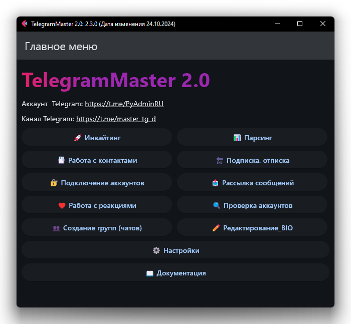
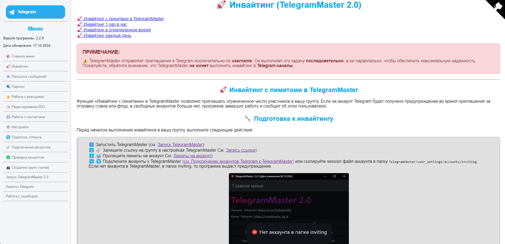

<h1 align="center">TelegramMaster 🚀 by. <a href="https://t.me/PyAdminRU" target="_blank">PyAdminRU</a></h1>

[English readme](README.eng.md) • [Русский readme](README.md) • [Lengua española readme](README.es.md)



<h2>📖 Descripción</h2>

- Nombre del proyecto: TelegramMaster 2.0 🚀<br>
- Versión actual: 2.5.0 🆕<br>
- Última fecha de actualización: 31.12.2024 📅<br > <br>

[](https://pypi.python.org/pypi/ansicolortags/)
[](https://t.me/PyAdminRU)

TelegramMaster 2.0 es una poderosa herramienta para trabajar con <a href="https://telegram.org/">Telegram</a> 📨.
Programa
ofrece muchas funciones para administrar cuentas, interactuar con los usuarios y automatizar procesos.

<h2>💻 plataformas Soportadas </h2>
TelegramMaster 2.0 es compatible con los siguientes sistemas operativos:<br><br>

<p align="center">

  
  
</p>

<h2>🛠️ tecnología</H2 >
El proyecto se desarrolla utilizando los siguientes lenguajes de programación:<br > <br>

<p align="center">
  
  
  
  
</p>

Basado en bibliotecas
📚: [Telethon](https://github.com/LonamiWebs/Telethon), [Flask](https://flask.palletsprojects.com/en/3.0.x/), [Flet](https://github.com/flet-dev/flet).

<h2>🚀 características Principales</h2>

TelegramMaster proporciona la siguiente funcionalidad:

* 📩 Inviting (invitar a los usuarios sin límites, en horario, etc.)
* 🔍 Análisis (recopilación de datos sobre grupos, canales y participantes)
* 📇 Trabajar con contactos (agregar, eliminar y administrar contactos)
* 📢 Suscribirse y darse de baja de canales / grupos
* 📤 Enviar mensajes y archivos (a mensajes privados y grupos con contestadores automáticos)
* 👁 ️ ️ ️ El trabajo con las reacciones (el engaño de las vistas y la automatización de las reacciones)
* 🛠 ️ Administración de cuentas (verificación, conexión, configuración de límites y proxy)
* ✏ ️ Edición de perfil (BIO, nombre de usuario, foto)
* ⏳ Configuración de límites y tiempo (para suscripción, invitación y distribución)

Puede consultar la lista completa en la lista completa
funciones: "[lista completa de funciones] (docs / Completa_funciones. md)"

Con configuraciones flexibles y la capacidad de trabajar con múltiples
a pesar de las restricciones de <code > Telegram </code><code>TelegramMaster < / code>
tiempo y mejora la eficiencia del trabajo 💼.

Además, < code>TelegramMaster < / code> proporciona conectividad
servidores proxy 🛡️.

Es importante tener en cuenta que < code>TelegramMaster</code>🚀 se ha desarrollado activamente desde <B>29.01.2022< / B>
año y se actualiza regularmente y
se complementa con nuevos
características para satisfacer las cambiantes demandas del mercado 📈 y las necesidades de los usuarios 🤝.

> ⚠ ️ Este proyecto es un repositorio personal (abierto) creado para desarrollar nuevas versiones del programa.
> Con todas las funciones
> la versión se puede encontrar en el canal <https://t.me/master_tg_d>.

<h2>📦 Instalación</h2>

<h3>Windows 🪟</h3>

1. Instalación De Python 🐍:

* Vaya al sitio web oficial de Python.
* Descargue la Última versión estable de Python.
* Ejecute la instalación y asegúrese de agregar Python a las variables de entorno (PATH).
* Compruebe la instalación a través del símbolo del sistema con el comando:

```sh
python --version
```

2. Instalación De TelegramMaster 🚀:

* Clonar el repositorio:

```sh
https://github.com/pyadrus/TelegramMaster-2.0.git
```

* Vaya a la carpeta del proyecto e instale las dependencias:

```sh
pip install -r requirements.txt
```

<h3>macOS 🍏</h3>

1. Instalación De Python:

* Abra el terminal e instale Homebrew 🍺 si aún no está disponible:

```sh
/bin/bash -c "$(curl -fsSL https://raw.githubusercontent.com/Homebrew/install/HEAD/install.sh)"
```

* Instalar Python 🐍:

```sh
brew install python
```

Compruebe la instalación de Python 🐍:

```sh
python3 --version
```

2. Instalación De TelegramMaster 🚀:

* Clone el repositorio e instale las dependencias de manera similar a la instalación en Windows.

<h3>Linux 🐧</h3>

1. Instalación De Python 🐍:

* Actualice los paquetes e instale Python 🐍:

```sh
sudo apt update
sudo apt install python3
```

Compruebe la instalación:

```sh
python3 --version

```

2. Instalación De TelegramMaster:

* Clone el repositorio e instale las dependencias como en los sistemas anteriores.

<h3>instalación de TelegramMaster 2.0</h3>

<hr align="center"/>

<h2>🔧 Documentación y ejemplos de uso</h2>



La documentación detallada sobre el trabajo con TelegramMaster se encuentra en la sección docs 📜, así como el
lanzamiento de la documentación implementado
directamente desde el programa.
Allí encontrará instrucciones para cada módulo y ejemplos de código para automatizar tareas 🔄.

<hr align="center"/>

<h2>💬 Comentarios</h2>
Si tiene alguna pregunta o sugerencia📝, póngase en contacto conmigo a través de:<br> <br>

<p align="center">
  <a href="https://t.me/PyAdminRU">
    
  </a>
  <a href="https://github.com/pyadrus">
    
  </a>
</p>


<h2>📢 información Adicional</h2>

No olvide suscribirse al canal oficial de Telegram🛎️, donde se publican actualizaciones y noticias sobre el proyecto.

Disfrute de su uso! 🚀